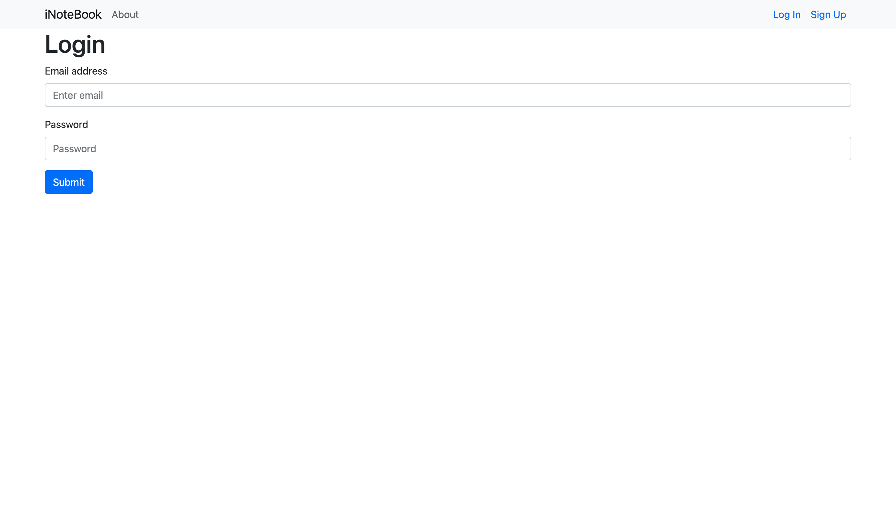
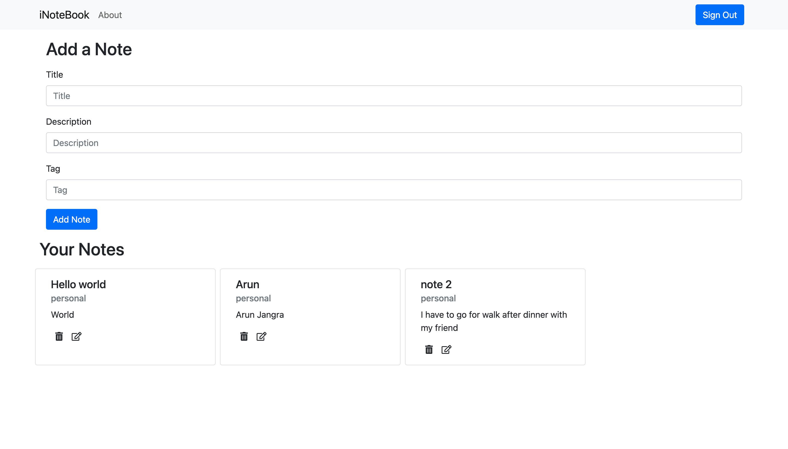
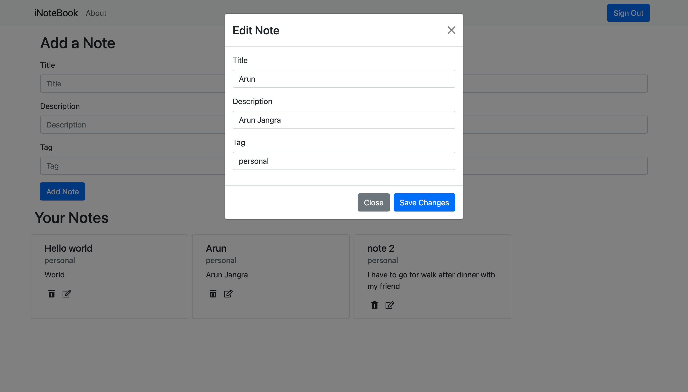

# iNotebook Notes Taking Website (ReactJs, NodeJs, Express, Mongodb and Bootstrap)
## This was a project built with a follow along tutorial

<h1 align="center">Built With</h1>
<p align="center">
 <a href="https://getbootstrap.com" target="_blank" rel="noreferrer">  </a> <a href="https://expressjs.com" target="_blank" rel="noreferrer">  </a> <a href="https://www.mongodb.com/" target="_blank" rel="noreferrer">  </a> <a href="https://nodejs.org" target="_blank" rel="noreferrer">  </a> <a href="https://www.python.org" target="_blank" rel="noreferrer">  </a> <a href="https://reactjs.org/" target="_blank" rel="noreferrer">  </a>
</p>

## Requirements
First clone your project and run the command in your command product
###### remember to navigate to the project folder in order to avoid the errors
```sh
npm install
```
## How to Proceed
* To Clone the repo run the command given below:
```sh 
git clone https://github.com/Arun89-crypto/whats-app-clone-react-firebase.git
```
* Then Navigate to the folder and run
```sh
npm install
```
* Navigate to the backend/db.js
```sh
cd backend/
```
```sh
const mongoose = require('mongoose');
const mongoURI = "YOUR_URL"; //replace with your mongoURL
const Connect_to_mongo = () => {
    mongoose.connect(mongoURI, () => {
        console.log("connected to mongo successfully ....");
    })
}
module.exports = Connect_to_mongo;
```
###### Please remember to create a iNotebook named directory in MongoDb
* Run following commands in terminal from the root folder
```sh 
npm run both
```

## Features
* Use CRUD operations on any note
* Register Authentication

## Screenshots of Project
</img>
</img>
</img>
